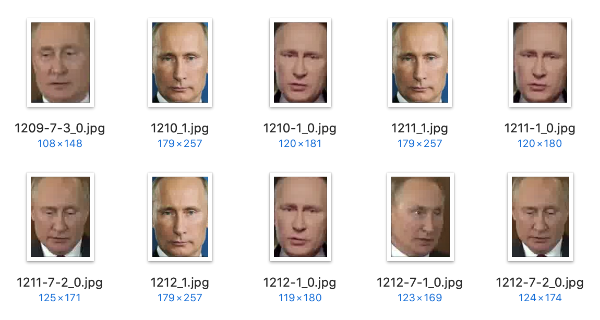
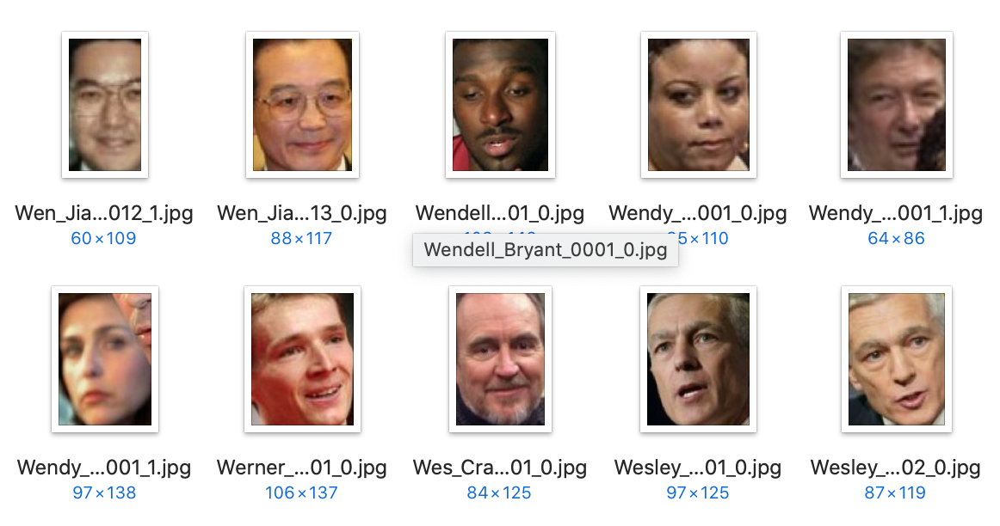

# Россия без Путина

<!-- illustration1.png -->

Главная цель проекта создать алгоритм позволяющий с высокой точностью распознавать лицо конкретного человека на видео в реальном времени и при необхоимости скрывать его.

## Установка

Для начала скачиваем репозиторий к себе на компьютер, любым из удобных способов. Например, это можно сделать с помощью команды `git clone`:

```sh
git clone https://github.com/freearhey/russia-without-putin.git
```

Далее заходим в папку с проектом и запускаем установку всех зависимостей:

```sh
# смена директории
cd russia-without-putin

# установка зависимостей
pip install -r requirements.txt
```

Вот и всё, установка закончена!

## Запуск

Чтобы запустить обработку видео трансляции необходимо в скрипт `main.py` через атрибут `--input`  передать лишь ссылку на неё:

```sh
python main.py --input http://uiptv.do.am/1ufc/000000006/playlist.m3u8
```

После чего трансляция автоматически откроется в новом окне:

<!-- screenshot1.png -->

Чтобы сохранить результат обработки у себя на компьютере к вызову скрипта необходимо добавить атрибут `--output` с путем до конечного файла:

```sh
python main.py --input http://uiptv.do.am/1ufc/000000006/playlist.m3u8 --output path/to/output.mp4
```

Вместо прямой трансляции в скрипт можно так же передать и обычное видео:

```sh
python main.py --input examples/video.mp4 --output path/to/output.mp4
```

Прервать запись, как и обработку можно нажатием клавиши 'q'.

## Принцип работы алгоритма

Первый этап - поиск подходящих позитивных и негативных примеров. В данном случае "позитивными" являются фотографии лица Путина, а "негативными" фото лиц любх других людей. 

Для получения большого числа примеров лица Путина использовались видеозаписи его выступлений из которых с помощью отдельного Python скрипта [freearhey/face-extractor](https://github.com/freearhey/face-extractor) автоматически было извлечено 12,308 фото.



В качестве "негативных" примеров использовался [freearhey/face-dataset](https://github.com/freearhey/face-dataset) состоящий из более чем 14,000 фото лиц различных людей. При этом в нём так же есть фотографии Путина, но перед обработкой они были перенесены в папку с "позитивыными" примерами, в результате чего общее количество "негативных" примеров составило 14,902 фото.



В итоге получилась следующая структура данных:

```
dataset/
  putin/
  non-putin/
```

Следующий этап - создание модели 

## Тренировка модели

При желании вы можете создать свою собственную модель которая будет настроена для распознавания любых других персон. Для этого в скрипт `train_model.py` необходимо передать путь до папки с позитивными, а так же негативными примерами:

```sh
python train_model.py --dataset path/to/dataset
```

Папка `non-putin` в данном случае полностью состоит из фотографий [freearhey/face-dataset](https://github.com/freearhey/face-dataset).

## В планах

- добавить распознавание текста
- добавить распознавание звука
- ускорить обработку отдельного кадра
- увеличить точность распознавания
- уменьшить количество "false positive" результатов
- запустить ретрансляцию обработанного видео

## Как помочь?

Если вы нашли какую-то ошибку или у вас есть идея как можно улучшить данный алгоритм, можете написать об этом [сюда](https://github.com/freearhey/russia-without-putin/issues).

## Лицензия

[MIT](LICENSE)