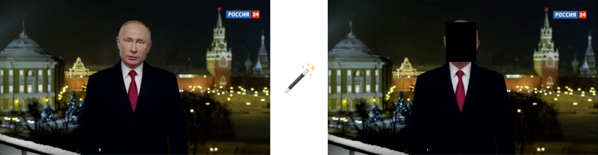
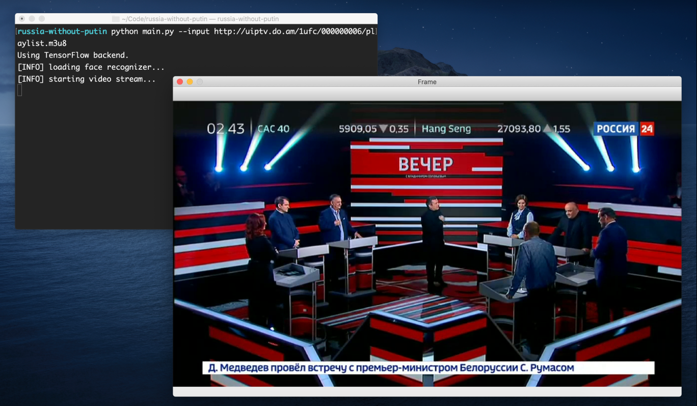
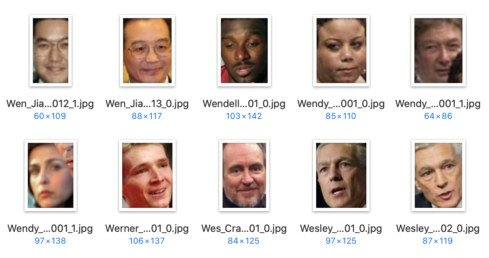

# Россия без Путина



Главная цель проекта - создать алгоритм позволяющий в реальном времени и с высокой точностью распознавать лицо конкретного человека на видео и при необходимости скрывать его.

## Установка

Для начала скачиваем репозиторий к себе на компьютер, любым из удобных способов. Например, это можно сделать с помощью команды `git clone`:

```sh
git clone https://github.com/freearhey/russia-without-putin.git
```

Далее заходим в папку с проектом и запускаем установку всех зависимостей:

```sh
# смена директории
cd russia-without-putin

# установка зависимостей
pip install -r requirements.txt
```

Всё, установка закончена!

## Запуск

Чтобы запустить обработку видео трансляции достаточно в скрипт `main.py` через атрибут `--input`  передать ссылку на неё:

```sh
python main.py --input http://uiptv.do.am/1ufc/000000006/playlist.m3u8
```

После чего трансляция автоматически откроется в новом окне:



Чтобы сохранить результат обработки у себя на компьютере к вызову скрипта необходимо добавить атрибут `--output` с путем до конечного файла:

```sh
python main.py --input http://uiptv.do.am/1ufc/000000006/playlist.m3u8 --output path/to/output.mp4
```

Вместо прямой трансляции в скрипт так же можно передать обычное видео:

```sh
python main.py --input examples/video.mp4 --output path/to/output.mp4
```

Прервать запись, как и обработку можно нажатием клавиши `q`.

## Принцип работы алгоритма

Работу всего алгоритма можно разбить на 4 главных этапа:

- [Сбор данных]() 
- [Создание "обучение" модели]() 
- [Поиск лица на видео]() 
- [Распознавание лица]() 

### Сбор данных

Для того чтобы создать модель которая могла бы математически описывала какое-то лицо необходимо сначала собрать подходящие "позитивные" и "негативные" примеры. В данном случае "позитивными" являются фотографии лица президента РФ В.В. Путина, а "негативными" фотографии лиц любых других людей. 

В данном случае для получения большого числа "позитивных" примеров лица использовались видеозаписи выступлений Путина на канале "Россия 24", из которых с помощью отдельного скрипта [freearhey/face-extractor](https://github.com/freearhey/face-extractor) автоматически было извлечено 12,308 фото.


В качестве "негативных" примеров использовался [freearhey/face-dataset](https://github.com/freearhey/face-dataset) состоящий из более чем 14,000 фото лиц различных людей. В данной коллекции так же присутствуют фотографии Путина, но перед обработкой они были перенесены в папку с "позитивыными" примерами, в результате чего общее количество "негативных" примеров составило 14,902 фото.



В итоге была создана следующая структура данных:

```
dataset/
  putin/
  non-putin/
```

### Создание "обучение" модели

Первым этапом в создании модели является создание 128-мерного вектора для каждого лица (так же называемого "Face embeddings"). В данном случае это делается с помощью [Deep Neural Network модуля OpenCV](https://docs.opencv.org/master/d2/d58/tutorial_table_of_content_dnn.html) и Torch модели проекта [OpenFace](https://cmusatyalab.github.io/openface/) - [nn4.small2.v1.t7](https://storage.cmusatyalab.org/openface-models/nn4.small2.v1.t7). После чего, полученные вектора конвертируются в 1-мерные с использованием метода [numpy.ndarray.flatten](https://docs.scipy.org/doc/numpy/reference/generated/numpy.ndarray.flatten.html) и уже в таком виде используются далее для тренировки модели.

Далее происходит само "обучение" модели, которая и будет математически описывать в чем разница между лицом Путина и лицами других людей. Для этого в данном случае используется алгоритм [Support Vector Machines (SVM)](https://scikit-learn.org/stable/modules/svm.html#support-vector-machines) из библиотеки [scikit-learn](https://scikit-learn.org/stable/). Он позволяет автоматически разбить полученные тысячи векторов на две группы: `'putin'` и `'non-putin'`. Полученный в итоге объект затем конвертируется в байты с помощью метода [pickle.dumps](https://docs.python.org/3/library/pickle.html#pickle.dumps) и сохраняется в файл `models/recognizer`.

Одновременно с этим в отдельный файл `models/label_encoder` сохраняются подписи (лейблы) для каждого вектора, чтобы впоследствии можно было определить чьё именно лицо этот вектор описывает. Перед сохранением все лейблы так же кодируются с помощью класса [LabelEncoder](https://scikit-learn.org/stable/modules/generated/sklearn.preprocessing.LabelEncoder.html) из той же библиотеки [scikit-learn](https://scikit-learn.org/stable/).

Запускается весь выше описанный процесс через скрипт `train_model.py`, в качестве аргумента в который передается путь до исходной папки с "позитивными" и "негативными" примерами:

```sh
python train_model.py --dataset path/to/dataset
```

### Поиск лица на видео

На данном этапе в обработчик загружается видео в котором будет проиходить поиск нужного лица, в данном случае это прямая трансляция канала "Россия 24". Загружается видео посредствам OpenCV класса [VideoCapture](https://docs.opencv.org/2.4/modules/highgui/doc/reading_and_writing_images_and_video.html#videocapture), после чего с его же помощью видеопоток разбивается на отдельные кадры.

Затем каждый кадр видео проходит через библиотеку [cvlib](https://github.com/arunponnusamy/cvlib), которая определяет расположение всех лиц в кадре и возвращает их координаты.

Под капотом данная библиотека так же использует [Deep Neural Network модуля OpenCV](https://docs.opencv.org/master/d2/d58/tutorial_table_of_content_dnn.html), но уже с заранее натренированной Coffe моделью - `res10_300x300_ssd_iter_140000`.

### Распознавание лица

Для этого этапа сначала необходимо загрузить обратно созданный нами ранее `models/recognizer`. Это делается с помощью метода [pickle.loads](https://docs.python.org/3/library/pickle.html#pickle.loads).

Затем каждое полученное на предыдущем этапе изображение лица проходит через тот же процесс создания 128-мерного вектора, что и примеры на этапе создания модели. После чего полученный вектор передается в метод [predict_proba()](https://scikit-learn.org/stable/modules/generated/sklearn.svm.libsvm.predict_proba.html) нашей модели `recognizer`.

На выходе для каждого лица мы получаем массив содержащий, в данном случае, два числа. Первое - вероятность от 0 до 1 что найденное лицо в кадре не принадлежит Путину, а второе - что принадлежит. Из них выбирается наибольшее значение и с помощью созданного ранее `models/label_encoder` определяется подходящий для этого лейбл.

Завершающий этап, вставка черного прямоугольника по координатам распознанного лица и его вывод вместе с исходным кадром на экран, с помощью `OpenCV` метода `imshow`.

## В планах

- добавить распознавание текста
- добавить распознавание звука
- ускорить обработку в целом
- уменьшить количество "false positive" результатов
- запустить ретрансляцию обработанного видео

## Как помочь?

Если вы нашли какую-то ошибку или у вас есть идея как можно улучшить данный алгоритм, лучше всего написать об этом [сюда](https://github.com/freearhey/russia-without-putin/issues).

## Лицензия

[MIT](LICENSE)